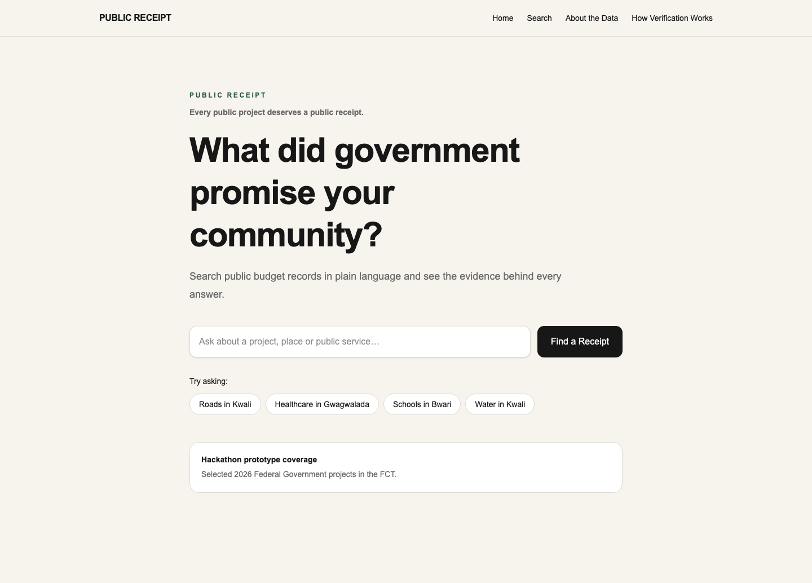
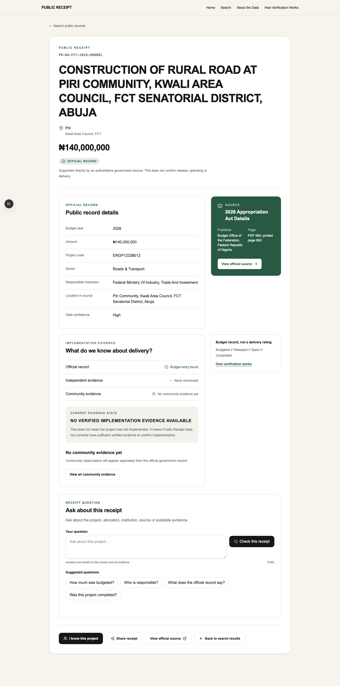
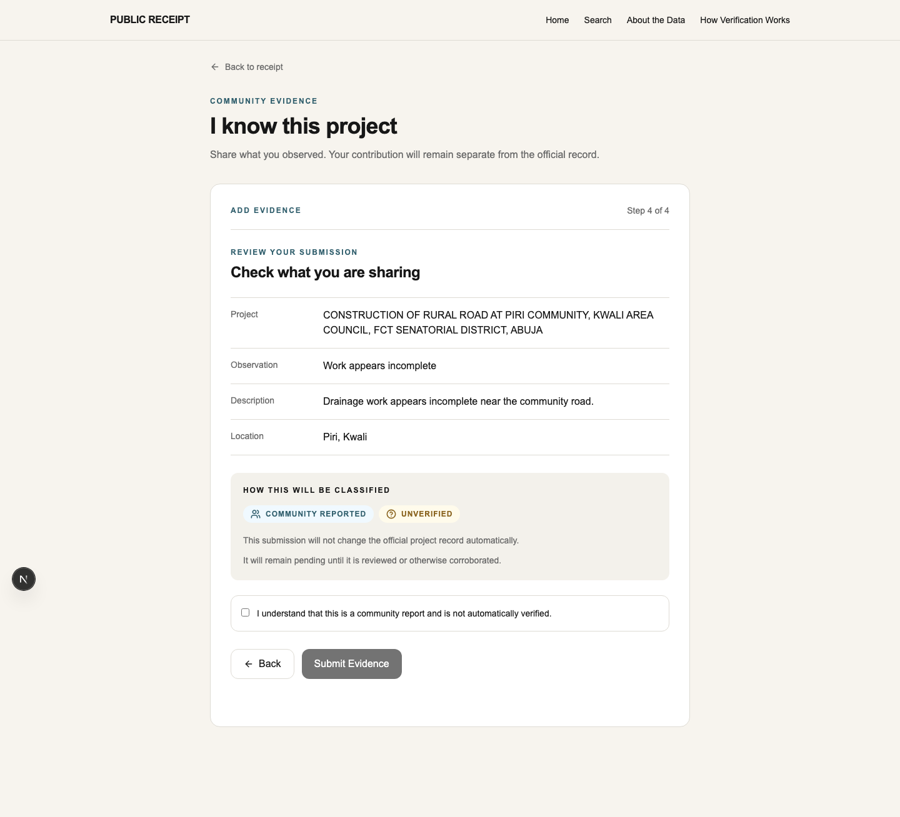

# Public Receipt

**Every public project deserves a public receipt.**

Public Receipt is an AI-assisted civic-information application that helps citizens ask what government promised their community, inspect the official source behind the answer, understand what evidence exists and contribute a clearly labelled community observation.

Hackathon track: **Transparency & Accountability**

## The problem

Public-budget information can be technically public while remaining difficult to discover and interpret. Citizens are expected to find large official documents, understand budget language and separately determine what the record does—or does not—say about delivery.

## The solution

Public Receipt turns a normal-language question into a deterministic search over verified civic records. Each result opens a source-backed receipt with the official wording, allocation, geography, responsible institution, provenance, implementation-evidence state, safe receipt-scoped questions and community evidence actions.

Core journey:

```text
ASK → FIND → UNDERSTAND → VERIFY → ACT
```

Core trust rule: **NO SOURCE, NO CLAIM.**

## Demo

Use `Roads in Kwali` and open `PR-NG-FCT-2026-000001`. The receipt shows a real ₦140,000,000 record for the Piri community road, retains its exact official excerpt and clearly states that a budget allocation does not prove implementation.

The complete judge flow is documented in [`docs/demo-script.md`](docs/demo-script.md).

## Screenshots

| Discovery | Public Receipt |
| --- | --- |
|  |  |

| Evidence contribution | Share preview |
| --- | --- |
|  |  |

Additional source and search views are available in [`docs/screenshots/`](docs/screenshots/).

## How it works

1. A strict interpreter extracts year, area council, sector and safe search terms.
2. Supabase PostgreSQL filters and ranks only indexed project rows.
3. The receipt joins each project to its retained official source reference.
4. Trusted AI answers only from an allowlisted receipt context; deterministic answers cover the demo facts and sensitive states.
5. Community observations enter private moderation as `community_report / pending / false` and cannot modify official civic records.
6. Share previews and PNG cards are generated only from stored receipt data and public evidence state.

## Trust architecture

```text
SOURCE DOCUMENT → PROJECT → PUBLIC RECEIPT → EVIDENCE
```

Official Record, Verified Evidence, Corroborated Community Evidence, Community Report, Unverified and Disputed are separate states. AI is an interaction layer, not the database.

**Budgeted ≠ Released ≠ Spent ≠ Completed.**

## Technology

- Next.js 16 App Router, React 19 and TypeScript
- Tailwind CSS
- Supabase PostgreSQL, Row Level Security and private Storage
- OpenAI Responses API with Zod Structured Outputs when enabled
- Sharp for safe image decoding and metadata-stripping re-encoding
- Vitest, Testing Library and Playwright

## AI usage

AI may interpret a search query and answer a question using the supplied receipt context. It may not invent projects, amounts, locations, institutions, expenditure, implementation status or allegations. Search has a deterministic fallback, common receipt questions have deterministic answers and core records remain usable when AI is unavailable.

## Data source and prototype coverage

The production seed contains 50 reviewed FCT capital-project records from the **Federal Republic of Nigeria 2026 Appropriation Act Details**, published by the Budget Office of the Federation. Every row retains a source URL and excerpt. Coverage is a curated prototype subset, not a complete FCT or national inventory.

See [`docs/data-methodology.md`](docs/data-methodology.md) for selection, extraction, normalisation, confidence and known omissions.

## Privacy and security

- Browser clients have read-only access to public civic records.
- Evidence writes pass through validated server logic and begin pending/private.
- Uploaded images are format-checked, resized, re-encoded without metadata and stored in a private bucket.
- Public evidence media uses short-lived signed URLs.
- No reporter name or precise coordinate is displayed publicly.
- Server and OpenAI credentials never use a `NEXT_PUBLIC_` prefix.

## Local setup

Requirements: Node.js 20.9 or later and pnpm.

```bash
cp .env.example .env.local
pnpm install
pnpm dev
```

Open `http://localhost:3000`.

## Environment variables

Required for hosted civic data:

```text
NEXT_PUBLIC_APP_URL
NEXT_PUBLIC_SUPABASE_URL
NEXT_PUBLIC_SUPABASE_PUBLISHABLE_KEY
SUPABASE_SECRET_KEY
```

Optional Trusted AI configuration:

```text
ENABLE_AI=true
OPENAI_API_KEY
OPENAI_MODEL
```

Never commit `.env.local` or secret values. See [`.env.example`](.env.example) for the complete template.

## Data validation and import

```bash
pnpm seed:validate
pnpm seed:import
```

Link the Supabase CLI to the intended project and dry-run migrations before applying them. Importing is an operational action; do not run it against an unintended database.

## Testing

```bash
pnpm lint
pnpm typecheck
pnpm test
pnpm build
pnpm test:e2e --workers=1
```

`pnpm quality` runs lint, type checking and unit/integration tests. CI does not require a live OpenAI call.

## Deployment

1. Create a Vercel project from this repository.
2. configure the environment variables above for the target environment;
3. set `NEXT_PUBLIC_APP_URL` to the canonical HTTPS deployment URL;
4. confirm Supabase RLS, the private evidence bucket and migrations are active;
5. run the production build and golden-path browser suite before judging.

## Current limitations

- Coverage is limited to 50 selected 2026 federal FCT records.
- The dataset does not establish release, expenditure, procurement or completion.
- No full moderator dashboard or citizen accounts are included.
- Anonymous submission protection uses strict validation and upload limits rather than a distributed rate limiter.
- Trusted AI requires optional server-side OpenAI configuration; deterministic safe answers remain available without it.

## Future roadmap

Future opportunities include wider verified ingestion, moderator workflows, procurement and expenditure sources, WhatsApp/USSD access, multilingual interfaces and stronger offline support. They are intentionally outside the submission build.
